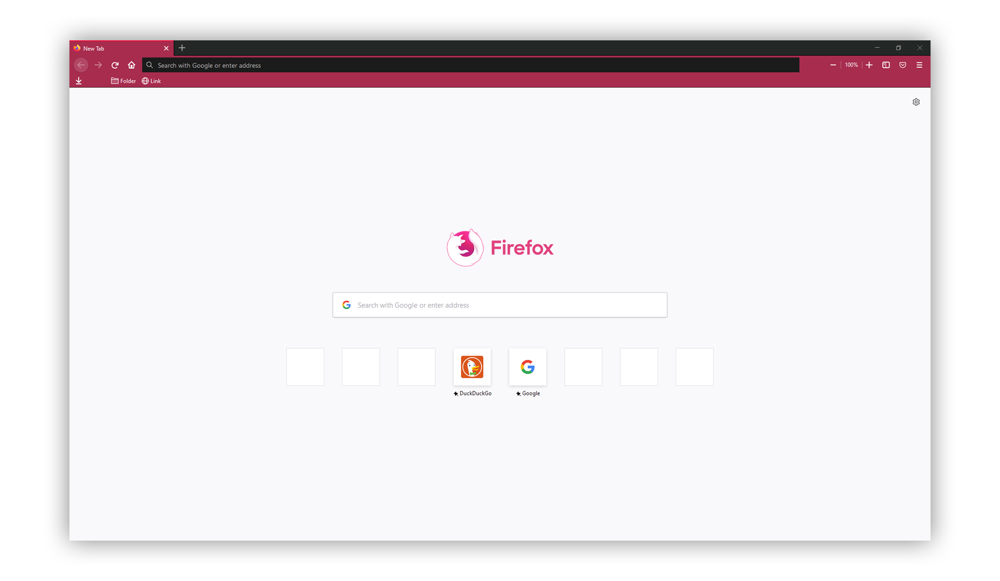
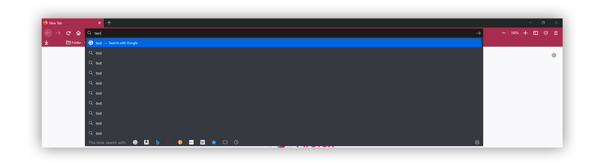

# Krusty's Firefox Theme




### Setup

1. Enable Settings (in about:config):
    ```
    toolkit.legacyUserProfileCustomizations.stylesheets	(to enable userChrome and userContent)
    svg.context-properties.content.enabled 		(to allow custom colors on imported svg from this folder)
    (without it Firefox only allows using svg context-* properties on images that are loaded from chrome:// and resource:// urls.)
    ```
2. Open Profile Folder
    ```
    Menu > Help > Troubleshooting Information > (Open) Profile Folder
    or: about:support > (Open) Profile Folder
    ```
3. Create a **chrome** folder

4. paste files into the **chrome** folder
